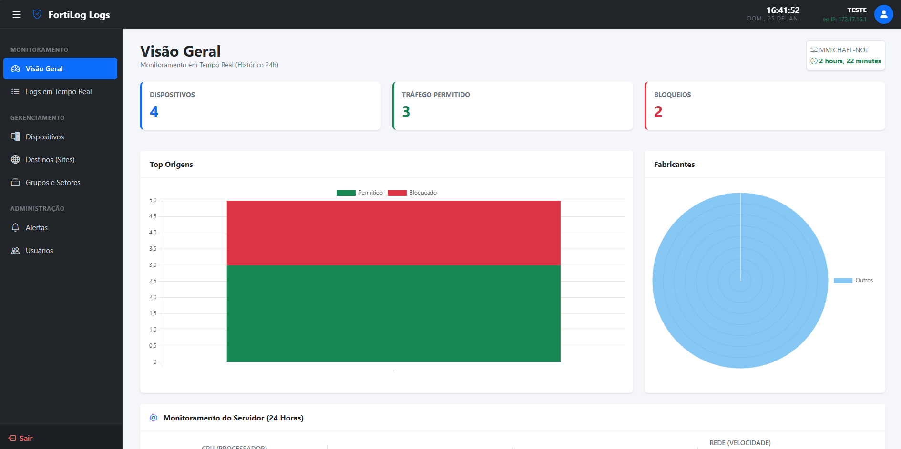
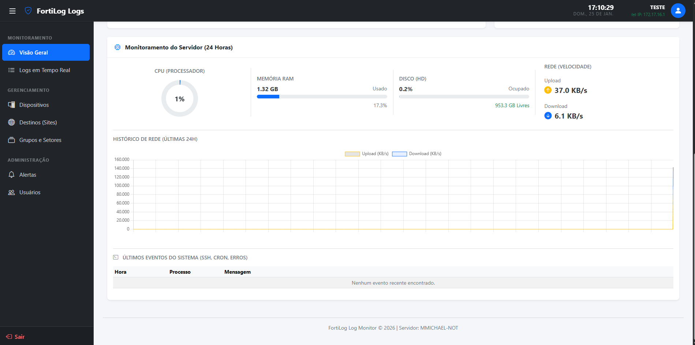
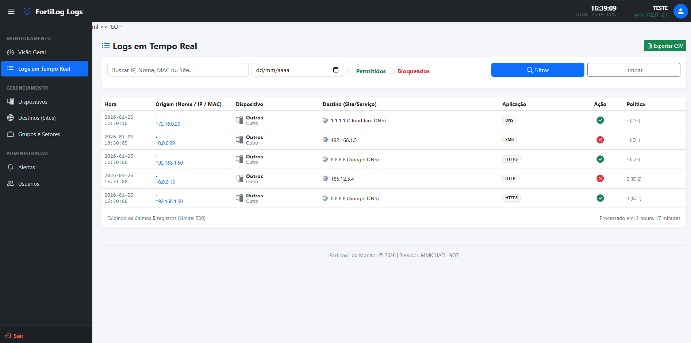
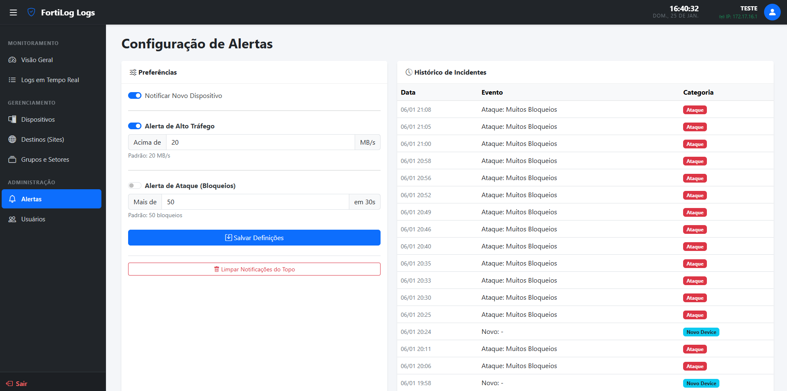
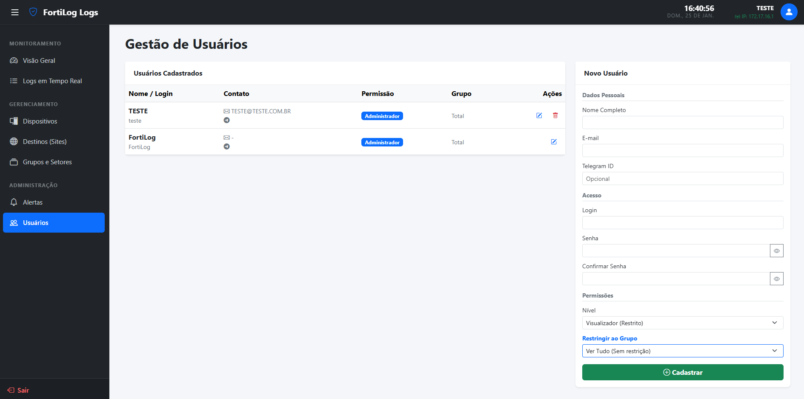
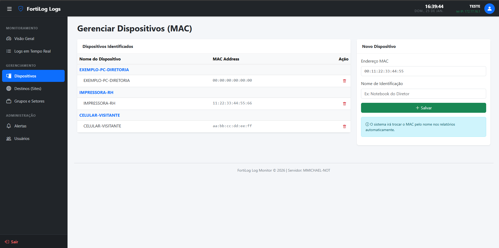
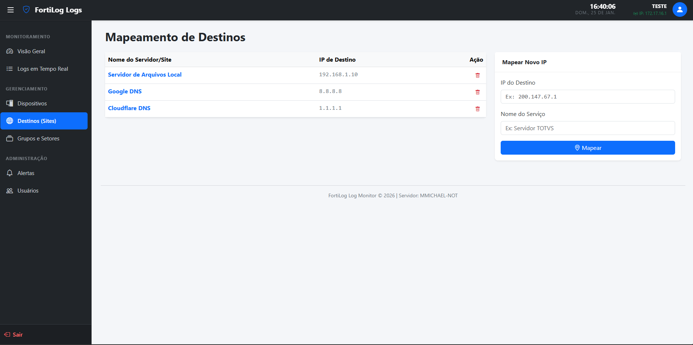

# 🛡️ FortiLog - Dashboard de Monitoramento para FortiGate


O **FortiLog** é uma solução de monitoramento em tempo real projetada para processar logs de firewalls FortiGate. Ele oferece uma interface visual intuitiva para analisar tráfego, identificar ameaças e monitorar a saúde do servidor (CPU/Memória).

## 🚀 Funcionalidades

* **Monitoramento em Tempo Real**: Visualização de logs de tráfego conforme eles chegam via Syslog/Tail.
* **Identificação Inteligente**: Reconhecimento automático de dispositivos (Apple, Windows, Android) e fabricantes.
* **Geolocalização**: Identificação de países de destino do tráfego.
* **Alertas via Telegram**: Notificações automáticas para picos de CPU ou falhas de login SSH.
* **Histórico de Performance**: Gráficos de consumo de recursos do servidor.

## 🛠️ Tecnologias Utilizadas

* **Backend**: Python 3, Flask
* **Frontend**: HTML5, CSS3, Bootstrap Icons, Chart.js
* **Sistema**: Otimizado para Linux (Debian/Ubuntu) e WSL.
* **Automação**: GitHub Actions (CI/CD Pipeline).

## 📸 Visão Geral




## 🚀 Funcionalidades
* **Monitoramento em Tempo Real**: Visualização de logs de tráfego conforme eles chegam.
* **Identificação Inteligente**: Reconhecimento automático de fabricantes (Apple, Samsung, Intelbras).
* **Alertas**: Notificações automáticas para picos de tráfego ou bloqueios massivos.
* **Gestão de Dispositivos**: Mapeamento de MAC Address para nomes amigáveis.

## 🖼️ Galeria

### Logs Detalhados


### Configuração de Alertas


### User Detalhados


### MAC Detalhados


### Destinos Detalhados


## ⚙️ Instalação e Execução (WSL/Linux)

1.  **Clone o repositório:**
    ```bash
    git clone [https://github.com/michaelwmarin/fortilog.git](https://github.com/michaelwmarin/fortilog.git)
    cd fortilog
    ```

2.  **Configure o ambiente:**
    Crie um arquivo `.env` na raiz do projeto:
    ```ini
    LOG_PATH=/opt/fortilog/logs/fortigate.log
    # Para usar dados de teste, descomente as linhas abaixo no código ou aponte para os arquivos _sample.json
    ```

3.  **Instale as dependências:**
    ```bash
    pip install flask psutil python-dotenv
    ```

4.  **Execute:**
    ```bash
    python3 app.py
    ```

5.  **Acesse:**
    Abra o navegador em `http://127.0.0.1:5000`

---
Desenvolvido por **Michael Marin**